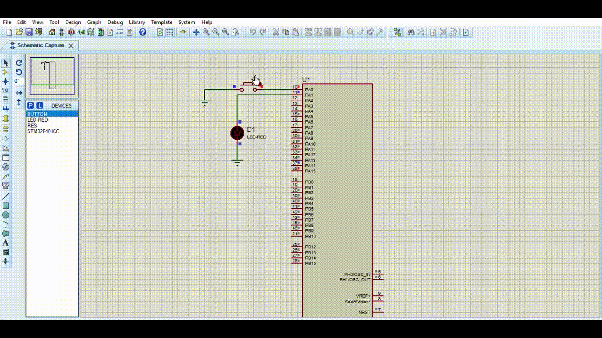
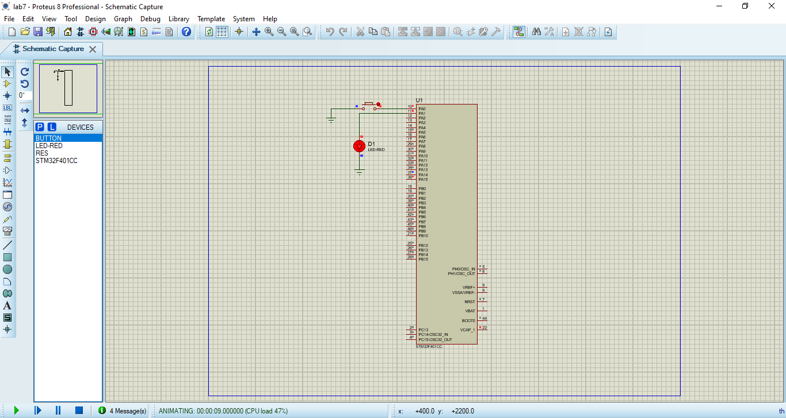

## Description

### A software to perform an LED toggle based on a button press.

The Software shall detect a falling edge event on the button pin and then toggle the LED in an ISR. You're required to:
* Enable GPIO clock and configure I/O as input
* Enable SYSCFG clock (RCC_APB2ENR) & configure external interrupt line mapping in SYSCFG_EXTICR
* Unmask the interrupt line in EXTI_IMR
* Configure the trigger selection bits (rising/falling) of the interrupt line EXRI_RSTR, EXTI_FSTR
* Configure and enable the interrupt line in NVIC (NVIC_ISER)
* When the interrupt is triggered, clear pending bit by programming it to 1 in EXTI_PR

## The output

